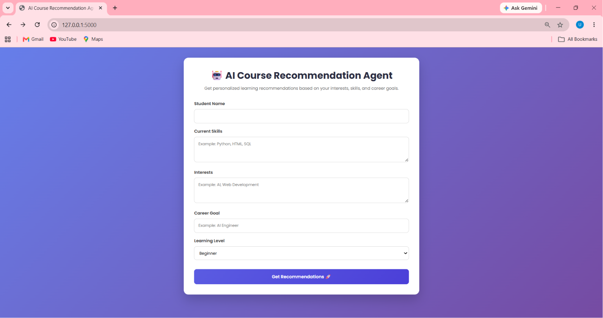
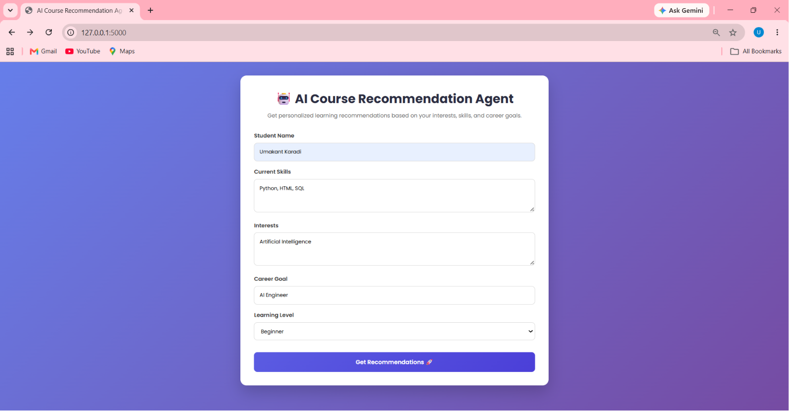
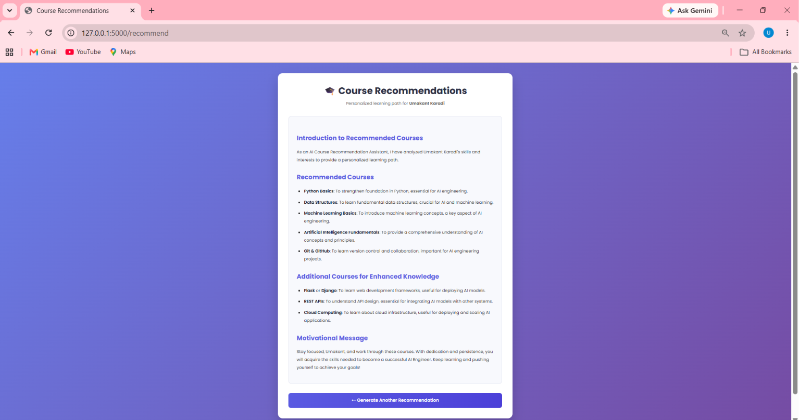

# 🤖 AI Course Recommendation Agent

An AI-powered web application that generates personalized course recommendations and learning paths based on a student's skills, interests, career goals, and learning level.

This project was developed using **Python**, **Flask**, and the **Groq LLM API** as part of the **Rooman AI Project Challenge**.

---

## 🚀 Features

- Personalized course recommendations
- AI-generated learning paths using Groq LLM
- User-friendly Flask web interface
- Responsive design
- Markdown-formatted AI responses
- Course database stored in JSON
- Dynamic recommendations based on user input
- Simple and clean UI

---

## 🛠️ Tech Stack

- Python
- Flask
- Groq API
- HTML5
- CSS3
- JSON
- Prompt Engineering
- Git & GitHub

---

<!-- ## 📂 Project Structure

```
CourseRecommendationAgent/
│
├── app.py
├── cli_app.py
├── requirements.txt
├── README.md
├── .gitignore
│
├── data/
│   └── courses.json
│
├── outputs/
│   ├── recommendations.json
│   └── recommendations.txt
│
├── sample_profiles/
│   ├── student1.txt
│   ├── student2.txt
│   ├── student3.txt
│   └── student_profiles.json
│
├── src/
│   ├── recommender.py
│   ├── prompt.py
│   └── courses.py
│
├── static/
│   └── css/
│       └── style.css
│
└── templates/
    ├── index.html
    └── result.html
``` -->
## 📂 Project Structure

```text
CourseRecommendationAgent/
│
├── app.py
├── cli_app.py
├── requirements.txt
├── README.md
├── .gitignore
│
├── data/
│   └── courses.json
│
├── outputs/
│   ├── recommendations.json
│   └── recommendations.txt
│
├── sample_profiles/
│   ├── student1.txt
│   ├── student2.txt
│   ├── student3.txt
│   └── student_profiles.json
│
├── screenshots/
│   ├── home.png
│   ├── form.png
│   └── recommendation.png
│
├── src/
│   ├── recommender.py
│   ├── prompt.py
│   └── courses.py
│
├── static/
│   └── css/
│       └── style.css
│
└── templates/
    ├── index.html
    └── result.html
```

---

## ⚙️ Installation

### 1. Clone the repository

```bash
git clone https://github.com/Umakant051/CourseRecommendationAgent.git
```

### 2. Move into the project folder

```bash
cd CourseRecommendationAgent
```

### 3. Create a virtual environment

```bash
python -m venv venv
```

### 4. Activate the virtual environment

Windows

```bash
venv\Scripts\activate
```

Linux / macOS

```bash
source venv/bin/activate
```

### 5. Install dependencies

```bash
pip install -r requirements.txt
```

### 6. Create a `.env` file

```text
GROQ_API_KEY=your_groq_api_key
```

### 7. Run the application

```bash
python app.py
```

Open your browser and visit:

```
http://127.0.0.1:5000
```

---

## 📋 How It Works

1. Enter your name.
2. Enter your existing skills.
3. Enter your interests.
4. Choose your career goal.
5. Select your learning level.
6. The application analyzes your input.
7. The AI generates a personalized learning path using the Groq LLM.

---

<!-- ## 📸 Screenshots

### Home Page

_Add `screenshots/home.png` here._

### Filled Form

_Add `screenshots/form.png` here._

### Recommendation Page

_Add `screenshots/recommendation.png` here._

--- -->
## 📸 Screenshots

### Home Page



### Filled Form



### Recommendation Page



## 🔮 Future Improvements

- User authentication
- Database integration
- Course filtering
- Course ratings
- PDF export of recommendations
- Course progress tracking
- Deployment to the cloud

---

## 👨‍💻 Author

**Umakant Karadi**

- GitHub: https://github.com/Umakant051
- LinkedIn: *(Add your LinkedIn profile URL here if you'd like.)*

---

## 📄 License

This project is intended for educational purposes and the Rooman AI Project Challenge.